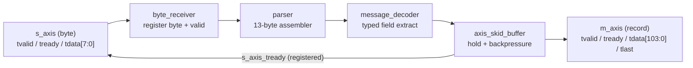

# Streaming Market-Data Message Decoder


A compact, fully-verified FPGA datapath (SystemVerilog) that ingests a byte
stream, assembles fixed-layout market-data messages, and decodes them into typed
records over a standard ready/valid streaming interface with lossless
backpressure.

The project is deliberately small and focused: one clean datapath, verified with
a randomized self-checking testbench and delivered with a synthesis flow —
rather than a broad, shallow feature set.


---

## Motivation

Exchange market-data feeds arrive as tightly-packed binary messages at high rate.
A hardware feed handler must accept bytes, assemble them into messages, and hand
decoded, typed fields to downstream logic — deterministically, and without
dropping data when the consumer stalls. This project implements the core of that
path: a streaming decoder with a proper ready/valid handshake, backpressure, and
a deterministic, measured latency.

---

## Architecture



Single clock domain, fully registered, one byte per cycle at full rate (II = 1).

### Block descriptions
| Module | Role |
|--------|------|
| `byte_receiver` | Registers the accepted byte together with its valid strobe, so the parser always sees an aligned (byte, valid) pair. |
| `parser` | 13-byte shift assembler; advances only on an accepted byte and pulses `message_valid` when a full message is collected. |
| `message_decoder` | Combinational field extraction: splits a message into `msg_type`, `order_id`, `price`, `quantity`; asserts `decoded_valid` only for known types. |
| `axis_skid_buffer` | Reusable, parameterized AXIS-compatible skid buffer. Registers the egress, holds the record until accepted, and drives ready backpressure with no combinational ready path. |
| `top` | Wires the datapath and exposes the streaming interfaces. |

---

## Parser

The parser is a 13-byte shift assembler. On each accepted input byte it shifts
the byte into a 104-bit message register and increments a byte counter; on the
13th byte it asserts `message_valid` for one cycle and resets. Because it only
advances on an accepted byte (`byte_valid`), it stalls cleanly whenever ingress
is backpressured — no bytes are lost or duplicated.

## Decoder

`message_decoder` is purely combinational. It treats the assembled 104-bit word
as `type(1) | order_id(4) | price(4) | quantity(4)` (big-endian) and, when
`message_valid` is high, decodes the type:

| Type | Byte | Meaning |
|------|------|---------|
| `'A'` | 0x41 | Add Order |
| `'P'` | 0x50 | Trade |
| other | — | ignored (`decoded_valid` stays low, no egress beat) |

The one-cycle decoded result is captured by the egress skid buffer on
`decoded_valid`, so the record is then held stable until the sink accepts it.

Egress record (104 bits): `{msg_type[7:0], order_id[31:0], price[31:0], quantity[31:0]}`.

---

## Ready/valid protocol

Minimal AXI4-Stream-compatible subset. A transfer happens only when
`tvalid && tready`; `tdata` is held stable while stalled; `tready` is
register-driven, so there is no combinational `m_ready → s_ready` path.

- **Ingress `s_axis`** — continuous byte stream: `tdata[7:0]`, `tvalid`, `tready`.
- **Egress `m_axis`** — one decoded record per beat: `tdata[103:0]`, `tvalid`,
  `tready`, `tlast`.

The egress skid buffer holds the record when the sink is not ready and, when
full, drives `s_axis_tready` low to stall ingress — so no record is ever
dropped (verified below).

---

## Verification

`tb/tb_top.sv` is self-checking. See `docs/VERIFICATION.md`.

- **Scoreboard** — every decoded record is compared, in order, against an
  expected-record FIFO; a beat with no pending expected record is flagged as a
  spurious-output error.
- **Directed tests** — Trade (`'P'`), Add Order (`'A'`), and an unknown type
  (must produce *no* egress beat).
- **Randomized testing** — 200 messages of random type (A / P / unknown) with
  random 32-bit fields, driven with random input stalls and random egress
  backpressure, proving lossless, in-order delivery under stress.
- **Assertions** — procedural checks (spurious beat, record mismatch) run under
  Icarus. Concurrent SVA (ready/valid stability, ready-low-implies-full) run on
  SVA-capable tools with `+define+SVA`.

---

## Results

Actual simulation output:

```
TB_TOP: latency=3 cycles
TB_TOP: throughput=2730 bytes in 4332 cycles
TB_TOP: scoreboard expected=142 matched=142 errors=0
TB_TOP: PASS
```

- **Latency: 3 cycles** from the input beat that completes a message to the
  record on `m_axis`.
- **Throughput:** the datapath is one byte per cycle at full rate (II = 1). The
  figure above is the aggregate over the full randomized run, which deliberately
  injects random input stalls and egress backpressure — 2730 bytes accepted over
  4332 cycles.
- **Correctness:** 142 decoded records, 142 matched, 0 errors, 0 dropped.
- **Fmax / area:** see `docs/TIMING.md` (populated from Vivado).

---

## Simulation (Icarus Verilog)

```bash
mkdir -p sim
iverilog -g2012 -o sim/top_sim \
  rtl/axis_skid_buffer.sv rtl/byte_receiver.sv rtl/parser.sv \
  rtl/message_decoder.sv rtl/top.sv tb/tb_top.sv
vvp sim/top_sim
```
Final line: `TB_TOP: PASS`. CI runs this on every push (`.github/workflows/ci.yml`).

## Synthesis (AMD Vivado)

```bash
vivado -mode batch -source syn/synth.tcl
```
Produces `syn/timing_summary.rpt` and `syn/utilization.rpt`; numbers are
transcribed into `docs/TIMING.md`. No timing numbers are invented in this repo.

---

## Repository layout

```
rtl/    RTL sources (datapath + reusable skid buffer)
tb/     self-checking testbench
syn/    Vivado synthesis TCL + timing constraints
docs/   ARCHITECTURE.md, VERIFICATION.md, TIMING.md
.github/workflows/  CI (Icarus compile + simulate)
sim/    simulation build output (gitignored)
```

---

## Design tradeoffs

- **AXIS subset, not full AXI4-Stream** — standard, recognizable signalling with
  no unused sidebands; composes with vendor IP if extended later.
- **Skid buffer for backpressure** — costs a small register stage but removes the
  combinational ready path and makes the egress lossless and stable. The fast
  path is II = 1, so backpressure is never paid for when idle.
- **Combinational decoder + registered skid egress** — keeps the decoder trivial
  and avoids a duplicated output register.
- **Fixed 13-byte message** — matches the target record and keeps the parser a
  simple, deterministic shift assembler.

## Future improvements

- Length/delimiter framing with resynchronization (recover from a dropped byte).
- Additional message types via a parameterized decode table.
- Multi-byte/cycle datapath for line-rate ingest.
- Formal verification of the handshake using the provided SVA.

These are out of the current scope, which targets a small, correct, fully-verified core.
