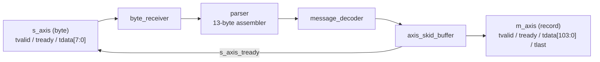

# Architecture

## Overview
A streaming market-data message decoder: a byte stream enters over a ready/valid
interface, is assembled into fixed 13-byte messages, decoded into typed records,
and emitted over a ready/valid interface with lossless backpressure. Single
clock domain, fully registered, one byte per cycle (II = 1).

## Block diagram

## Interfaces
### Ingress `s_axis` (byte)
| signal | dir | width | meaning |
|--------|-----|-------|---------|
| s_axis_tvalid | in  | 1 | byte valid |
| s_axis_tready | out | 1 | decoder can accept (register-driven) |
| s_axis_tdata  | in  | 8 | byte |

### Egress `m_axis` (record)
| signal | dir | width | meaning |
|--------|-----|-------|---------|
| m_axis_tvalid | out | 1   | record valid |
| m_axis_tready | in  | 1   | sink can accept |
| m_axis_tdata  | out | 104 | {msg_type[7:0], order_id[31:0], price[31:0], quantity[31:0]} |
| m_axis_tlast  | out | 1   | one beat per record |

## Message format
13 bytes, big-endian: `type(1) | order_id(4) | price(4) | quantity(4)`.
Decoded: `'A'`(0x41) Add Order, `'P'`(0x50) Trade. Unknown types produce no
egress beat.

## Clock / reset
Single clock `clk`. Synchronous, active-low reset `rst_n` in every sequential
block. No clock-domain crossings (deliberately out of scope for a block-level
core; CDC would live at a MAC/PHY boundary in a full system).

## Pipeline & latency
Three registered stages from an input beat to its record:
1. `byte_receiver` registers the accepted byte + valid.
2. `parser` shifts the byte in; on the 13th byte it asserts `message_valid`.
3. `axis_skid_buffer` captures the decoded record (decoder is combinational).

Measured latency: **3 cycles**. Peak throughput: **1 byte/cycle (II = 1)**; see docs/TIMING.md for the measured randomized-run aggregate.

## Key design decisions
- **AXI4-Stream-compatible ready/valid subset** (`tvalid/tready/tdata`, plus
  `tlast` on egress) — a standard, recognizable interface with no speculative
  sidebands. Ingress carries no `tlast`: it is a continuous byte stream.
- **Skid buffer for backpressure** — `s_axis_tready` is driven from a register
  (`~skid_full`), so there is no combinational `m_ready → s_ready` path (better
  timing). The skid also holds the decoded record stable until accepted,
  removing the one-cycle-output fragility of a bare combinational decoder.
- **Backpressure is loss-free by construction** — ingress accepts a byte only
  while the egress skid can accept, and at most one record can be in flight
  (a new one needs 13 more bytes), so no record is ever dropped. Verified with a
  randomized scoreboard test (0 loss, 0 spurious, in-order).
- **Combinational decoder + registered skid egress** — keeps the decoder purely
  functional and avoids a duplicated output register.
- **Single clock, II = 1** — deterministic latency and throughput; the fast path
  never pays for backpressure it does not exert.
